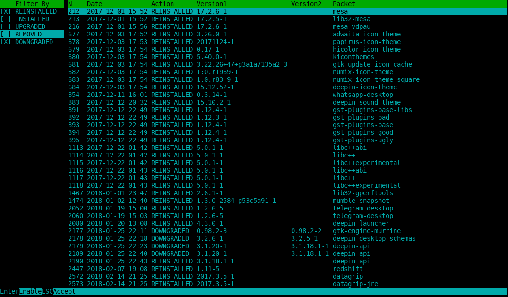

# PacmanLogger

An application with terminal GUI inspired by htop that makes Arch pacman's logs easier to read. Written in Scala

## Dependencies
  - Scala (http://www.scala-lang.org/)
  - lanterna-3.0.0 (https://github.com/mabe02/lanterna)
  - scala-parser-combinators (https://github.com/scala/scala-parser-combinators)
